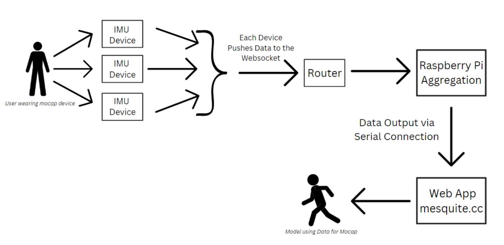
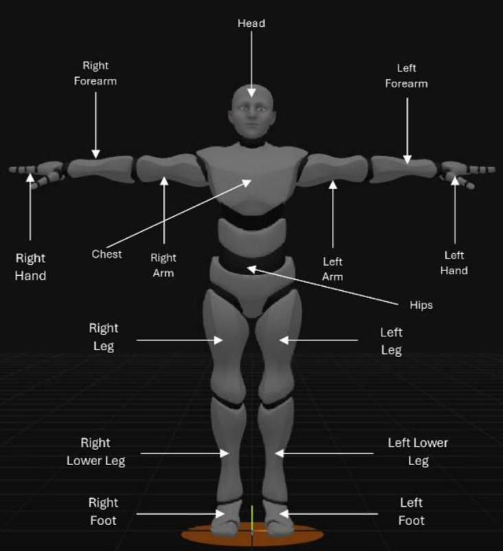
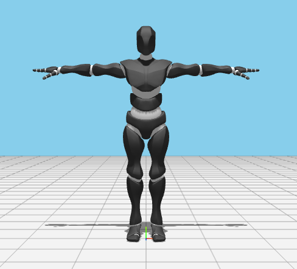

# **Previous draft for the Paper**

# **Abstract**

This paper introduces an affordable, flexible, and real-time motion capture(MoCap) system leveraging wearable IMU sensors. Unlike existing solutions, our system forgoes complex camera setups and expensive Inertial Measurement Units (IMU) based solutions. The essence of our solution lies in the data processing step, which incorporates a sensor fusion algorithm using the Altitude and Heading Reference System (AHRS), axis rotations, and translations based on the Biovision Hierarchy structure. The processed data accurately animates a 3D human skeleton model in real-time, effectively mimicking the movements of the wearer. Users can interact with and record these movements through an intuitive web interface, which provides a three-dimensional representation of human motion. While not specifically tailored for a single use case, our system offers significant potential for diverse applications, including gait analysis, sports training, animation, and more. This flexibility makes our system a valuable & affordable tool for researchers, clinicians, trainers, and animators alike.

# **Introduction**

Motion Capture (MoCap) technology, renowned for its capacity to record detailed human movements, has found widespread applications in fields such as biomechanical research, clinical rehabilitation, animation, interactive entertainment, and sports medicine. The recent surge in virtual and augmented reality applications has further fueled the demand for high-quality & accessible MoCap systems.

Traditionally, optical MoCap systems, characterized by multiple cameras tracking markers on the user, have been the MoCap system most commonly used. Despite providing high-resolution, accurate data, they suffer from many drawbacks: complex setup, high costs, and the need for optimal lighting conditions. These challenges often lead to a lack of accessibility for many potential users. In response to these challenges, there has been a shift towards the implementation of inertial measurement unit (IMU) based systems. IMU-based MoCap systems are portable, easy to use, and do not depend on external environmental conditions. This makes them ideal for use outside a studio setting. Various companies like Xsens have introduced wearable IMU-based MoCap systems. However, these solutions are still costly, due to proprietary hardware and software, and the use of high-end IMUs to ensure data quality.

On the other hand, users who look at more affordable Motion Capture systems tend to sacrifice the quality of the motion capture. This results in the device not providing accurate results that represent the user's true motions, making its application extremely difficult to justify in many professional settings, where accuracy is needed. Hence, a potential motion capture user in the current market must decide between a affordable yet inaccurate or an accurate and expensive MoCap system.

To address these challenges, we developed an affordable, real-time MoCap system using low-cost IMUs (MPU9250 or BNO08X) equiped with a dual-core ESP32 microcontroller. Our system effectively processes raw sensor data to generate an accurate 3D model mirroring the user's movements. It features an interactive and user-friendly web interface, using Three.js graphics, which presents a virtual human structure that mimics the wearer's actions in real-time. This web-based approach offers a flexible platform, facilitating remote monitoring and expanding possibilities for at-home & professional applications.In addition, our system integrates a Biovision Hierarchy (BVH) recorder for capturing and replaying human motions. 

In addition to both affordability and accurate real-time capture capabilities, our motion capture system gives potential users the opportunity to adjust the hardware and software to best suit their needs dependent on their use cases for the motion capture system. Software can be edited as it is fully open-source, allowing for potential users to adjust segments of the code to work better for them. 

# **Background**
Our proposed system is a mix of both hardware and software components working together seamlessly. It primarily comprises wearable sensors (MPU9250 or BNO08X) and a dual-core ESP32 microcontroller affixed to the user’s body. Furthermore, a Node.js server operates on a central computer, overseeing data acquisition, data processing, and 3D visualization through a suite of JavaScript-based components. Each POD affixed to the user communicates with the router, raspberry pi, and eventually the web application. 

## **System Architecture**

The comprehensive system includes 15 wearable devices, PODs, that are affixed to the user's body through velcro straps directly attached to each POD. Each POD is labeled with respect to the body part that it should be placed on. Flexibility is key in our design; users can choose to use the devices on specific body parts such as the upper body, lower body, or legs. Each device consists of a self-calibrated IMU sensor (BNO08x with 9 DOF) and a dual-core ESP32 microcontroller. The microcontroller dedicates one core to reading quaternion data (to circumvent Euler's gimbal lock issue) from the connected IMU through the SCL and SDL pins. The other core broadcasts this data through web sockets at a steady rate of 30 frames per second, with the potential to reach 45 frames per second at times. The devices operate on battery power and are completely wireless, ensuring the movements the user can make are not limited. 

## **Mapping the Human Motion**

At the core of our software solution is a Node.js-based web server. To minimize computational overhead, the server employs a web worker that consistently reads data from the web sockets. Upon reception, each bone's data is processed separately. The raw sensor data, initially based on the local sensor's reference system, is converted to align with the reference system of the Three.js scene. We then adjust the rotation for each bone, accounting for its parent's rotation per the Biovision Hierarchy structure, and its initial T-pose value. When users stand in the T-pose and click the 'T-pose' button on the website, we record the rotation of each bone, which is then used as an offset for all future data. Consequently, we can animate the 3D human skeleton. Our web application allows for users to easily track each device. This feature also allows for simple troubleshooting as the user is able to view the functionality of each device after connection. 

Furthermore, our system includes a Biovision Hierarchy (BVH) recorder. When the user initiates the record button on the website, the system traverses the Three.js skeleton, records the Euler rotation of each joint in the global frame, and saves this data in a BVH file. This feature allows for convenient recording and subsequent playback of the motion(s) made by the user. 

# **Key Features**

## *Affordable Hardware:* 

Our system uses low-cost, easily accessible hardware components such as MPU9250, BNO08X, and a dual-core ESP32. This allows access for groups previously unable to afford MoCap devices to have the opportunity to now utilize motion capture technology for both personal and professional application(s). 

## *Real-Time Visualization:* 

The Node.js server processes the IMU data using the Mahony AHRS algorithm to derive rotations, which are then mapped onto a 3D human model visualized in the [web application](https://mesquite.cc/), which employs the use of Three.js. 

## *High Capture Rate:*

Our system can achieve up to 45 frames per second, providing smooth motion tracking while ensuring accuracy of the produced movements & recordings. 

## *Future Enhancement Plans:*

We aim to further enhance the frame rate and incorporate Bluetooth through a data transfer protocol. Also, we plan on extending to device to the hands & the face, eventually using a diffusion model to reduce the 15 nodes to just 6 nodes while maintaining at least the same level of accuracy. We also plan to develop a Recurrent Neural Network (RNN) in order to track the user's face & hand movements, which can be of use for identification purposes. 

## *Biovision Hierarchy (BVH) Recorder:*

The system includes a BVH recorder, enabling users to record, store, and replay the captured movements on the device they connected to the MoCap kit. 

# **Statement of Need:**

The need for efficient and cost-effective motion capture solutions has never been greater, with increasing demand in industries such as, but not limited to: film, animation, healthcare, and fitness. Traditional solutions either require costly, space-bound equipment, or they lack real-time capture capabilities. This results in potential users having no or extremely limited access to MoCap devices or having to use MoCaps with sub-par capture capabilities. Our innovative approach fills this gap by providing an affordable, flexible, and real-time solution to motion capture. Our MoCap device aims to solve both of the gaps aforementioned by developing a device that is extremely affordable for users & comprises of accurate real-time capture capabilities. This technology is designed to serve animation creators, filmmakers, health diagnostics professionals, fitness coaches, and any others who could benefit from accurate & affordable motion capture. As we continue to enhance its capabilities, we anticipate even broader applications and accessibility for this technology. Furthermore, this device allows for users previously unable to use MoCap systems to now reap their benefit personally & professionally. 

# **Installation Instructions:**

## **Prerequisites**
Ensure you have Node.js installed on your machine. If you don't have Node.js installed, you can install it from the [Official Website](https://nodejs.org/en/download)

## **Step 1: Clone the Repository**
Clone the repository to your local machine. This can be done using the following command: _**git clone https://github.com/Mesquite-Mocap/mesquite.cc-app**_

## **Step 2: Run the Node.js Server**
Navigate to the repository folder that you've just cloned. Once you are in the right directory, you can start the server by running the following command: **node server.js**

This will start the server on port **3000** and initiate two WebSocket servers. The first WebSocket server is at the route **/hub**, which receives data from the IMUs. This server then relays the messages to the second WebSocket server at the route **/web_client**.

## **Step 3: Connect the IMUs**
Once the server is running, you can start transmitting data from your IMUs to the **/hub** route of the WebSocket server.

## **Step 4: View the 3D Scene**
The static files with the Three.js scene listen to the /web_client route. As the server receives a message, it processes it, converts it into quaternion, and does the axis rotation. Then, it checks if the particular bone has any dependencies, offsets the dependency, and then maps it to the Three.js human model.

You can view the 3D scene by opening **http://localhost:3000**.

# **Usage**

You can view a detailed document featuring all of the steps on how to use the MoCap device & web application [here](https://docs.google.com/document/d/1Fr9YO1iRqgkOwfiHcC7wOiKtj6y1EImnh5eg-t4rpIA/edit?usp=sharing). This document covers in detail how to set up & effectively use the entire MoCap kit, from getting everything out of the box to saving recorded movements. 

# **Acknowledgements:**

We would like to express our sincere gratitude to **Bhargav Ragunath** for his instrumental help with hardware guidence and testing throughout the project. His expertise and dedication were invaluable.

Our heartfelt thanks go to the **Herberger Institute for Design and the Arts | School of Arts, Media and Engineering at Arizona State University**. The availability of the school's labs, resources, and continuous support contributed significantly to the successful completion of our research.

# **References**

Lee, K., & Tang, W. (2021). A Fully Wireless Wearable Motion Tracking System with 3D Human Model for Gait Analysis. Sensors, 21(12), 4051. https://doi.org/10.3390/s21124051

Gujarathi, T., & Bhole, K. (2019). GAIT ANALYSIS USING IMU SENSOR. 2019 10th International Conference on Computing, Communication and Networking Technologies (ICCCNT). https://doi.org/10.1109/icccnt45670.2019.8944545

Zeinali, B., Zandizari, H., & Morris, C. J. (2024). IMUNet: Efficient Regression Architecture for IMU Navigation and Positioning. ArXiv.org. https://arxiv.org/abs/2208.00068

adiog. (2018). embed-ahrs-madgwick/madgwick_internal_report.pdf at master · adiog/embed-ahrs-madgwick. GitHub. https://github.com/adiog/embed-ahrs-madgwick/blob/master/madgwick_internal_report.pdf

‌
